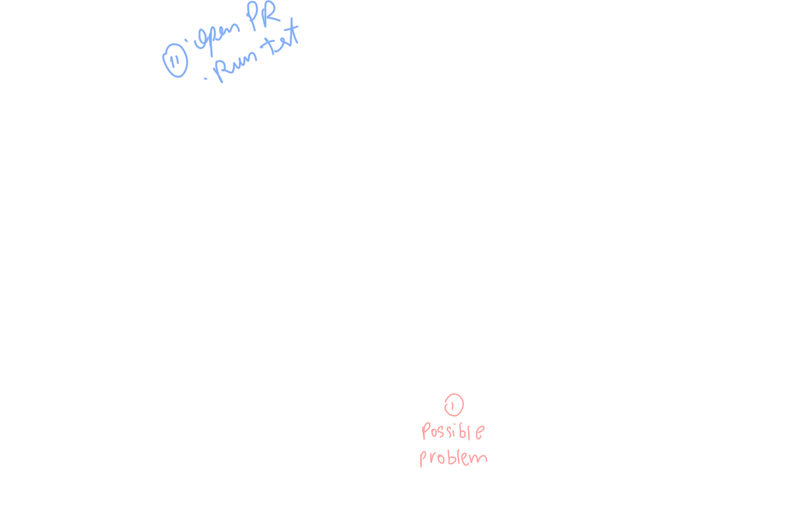

# Self-Healing Agentic Workflow PoC

An autonomous system proof-of-concept that observes, diagnoses, and repairs performance bottlenecks in a FastAPI application using a multi-agent orchestration.



## Project Overview

This repository contains a "Fake Plant Shop" API designed with intentional performance issues. It serves as a playground for:

- **Performance Agent:** To identify root causes via metrics and logs.
- **Coding Agent:** To propose and apply optimized code refactors.

## Getting Started

### Prerequisites

- Docker and Docker Compose

### Launch the Stack

1. Clone the repository.
2. Run the services:
   ```bash
   docker-compose up --build
   ```

### Access Points

- **API:** [http://localhost:8000](http://localhost:8000)
- **Interactive Docs (Swagger):** [http://localhost:8000/docs](http://localhost:8000/docs)
- **Metrics (Prometheus format):** [http://localhost:8000/metrics](http://localhost:8000/metrics)
- **Prometheus Dashboard:** [http://localhost:9090](http://localhost:9090)
- **Grafana Dashboard:** [http://localhost:3000](http://localhost:3000) (Login: Anonymous Admin enabled)

### Visualizing Performance

The Grafana instance comes pre-provisioned with an **API Performance Dashboard**.

- It monitors the average latency of the `/checkout` endpoint.
- **Red Alert Threshold:** The graph background/line will turn red when the latency exceeds 1 second, providing a visual cue for the performance issues we've intentionally introduced.
